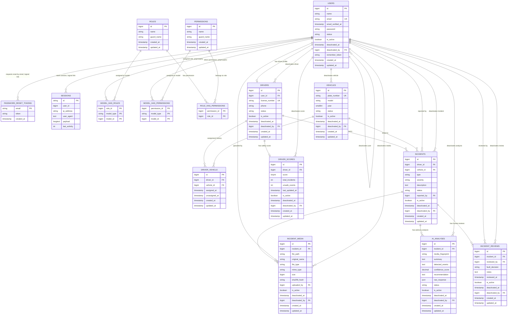

# Fleet Safety Monitoring / Taxi Driver Safety System

Senior Project By

[Student Name(s)]

[Student ID(s)]

Submitted to the School of Arts and Science of the Lebanese International University

In partial fulfillment of the requirements for the degree of

BACHELOR OF SCIENCE IN

COMPUTER SCIENCE AND INFORMATION TECHNOLOGY

Supervised by: [Instructor Name]

[Semester / Academic Year]

[University Logo Placeholder]

## Dedication

We dedicate this senior project to our families, instructors, friends, and everyone who supported us during our academic journey. Their encouragement, patience, and guidance helped us continue working and improving until the project reached its final form. We also dedicate this work to all drivers, fleet managers, and road safety teams who work every day to make transportation safer, more organized, and more responsible.

This project is also dedicated to every person who uses taxi and transportation services and expects a safe trip. Road safety is not only a technical topic. It is also a social responsibility. Through this project, we tried to build a system that can help companies follow incidents, protect drivers, support monitors, and improve fleet safety decisions.

## Acknowledgment

First, we would like to thank God for giving us the strength, patience, and knowledge needed to complete this project. We would also like to express our sincere gratitude to Lebanese International University and to the School of Arts and Science for giving us the opportunity to develop a practical senior project that combines software engineering, database design, web development, artificial intelligence, and user interface design.

Special thanks go to our supervisor, [Instructor Name], for the valuable guidance, advice, and support throughout the project. The feedback we received helped us improve the idea, organize the implementation, and prepare the report in a clear academic way.

We also thank our classmates and friends for their help, suggestions, and encouragement. Finally, we thank our families for their continuous support during the long development and testing period of this project.

## Abstract

Road safety is an important issue for taxi companies and fleet operators. Drivers may face accidents, unsafe driving situations, passenger complaints, or near-miss events during their daily work. In many companies, these incidents are still reported manually, reviewed slowly, or stored without proper organization. This can make it difficult for monitors and administrators to follow up on safety problems, evaluate driver performance, and keep accurate records.

The Fleet Safety Monitoring / Taxi Driver Safety System is a web-based platform designed to support taxi and fleet safety operations. The system includes three main roles: admin, monitor, and driver. Admins manage users, driver profiles, vehicles, and vehicle assignments. Drivers can report incidents and upload related media such as images, videos, or documents. Monitors can review incidents, view uploaded media, read AI-assisted observations, and submit the final human review decision. The system also calculates driver safety scores based on resolved incident reviews.

The application was developed using Laravel, Blade templates, MySQL, Laravel Storage, queue jobs, Spatie Laravel Permission, and OpenAI API support. The dashboard includes key performance indicators, charts, notification-style panels, filters, search tools, severity badges, CSV export features, and a deactivation workflow that preserves records instead of permanently deleting them. The AI analysis module uses a low-cost dashcam workflow: local OpenCV and YOLO screening is used first, important frames are selected, and OpenAI is called only when advanced visual analysis is needed. AI analysis is advisory only, while the final safety decision remains with the human monitor.

This project aims to provide a practical and professional solution for improving taxi driver safety management, incident tracking, media review, dashboard reporting, and fleet monitoring. It is suitable for a university senior project because it combines real-world system analysis with Laravel application development, relational database design, authorization, media processing, AI integration, testing, and modern dashboard UI/UX design.

## Table of Contents

1. Dedication
2. Acknowledgment
3. Abstract
4. Table of Contents
5. List of Tables
6. List of Figures
7. Chapter 1: Introduction
   1.1 Introduction
   1.2 Project Motivation
   1.3 Objective
   1.4 Scope
   1.5 Technology Constraints
   1.5.1 Software Needed
   1.5.2 Languages
   1.5.3 Frameworks and Libraries
   1.6 Problem
   1.7 Solution
   1.8 Limitations
8. Chapter 2: Functional and Nonfunctional Requirements
   2.1 Functional and Conceptual Study
   2.1.1 Functional Requirements
   2.1.2 Role Permission Matrix
   2.1.3 Nonfunctional Requirements
   2.2 Use Case Overview
9. Chapter 3: Database Design
   3.1 System Design
   3.2 Main Database Entities
   3.3 Database Relationships
   3.4 Deactivation Workflow
10. Chapter 4: Project Implementation and Pages
    4.1 Introduction
    4.2 Implementation Architecture
    4.3 Project Parts and Pages
    4.4 AI Dashcam Analysis Workflow
    4.5 Dashboard KPIs and Reporting
    4.6 Testing and Verification
11. Chapter 5: Conclusion and Future Work
    5.1 Conclusion
    5.2 Future Work
12. References

## List of Tables

Table 2-1: Main Functional Requirements

Table 2-2: Role Permission Matrix

Table 2-3: Nonfunctional Requirements

Table 3-1: Main Database Tables

Table 3-2: Main Entity Relationships

Table 4-1: Main System Pages

Table 4-2: AI Analysis Workflow Steps

Table 4-3: Driver Safety Score Rules

Table 4-4: Dashboard KPI Summary

Table 4-5: Testing Summary

## List of Figures

Figure 2-1: UML Use Case Diagram

Figure 3-1: Entity Relationship Diagram

Figure 4-1: System Architecture Diagram Placeholder

Figure 4-2: Role-Based Access Flow Placeholder

Figure 4-3: Login Page Screenshot Placeholder

Figure 4-4: Admin Dashboard Screenshot Placeholder

Figure 4-5: Dashboard KPI and Charts Screenshot Placeholder

Figure 4-6: Drivers Module Screenshot Placeholder

Figure 4-7: Vehicles Module Screenshot Placeholder

Figure 4-8: Incidents Module Screenshot Placeholder

Figure 4-9: Incident Details and Media Screenshot Placeholder

Figure 4-10: Incident Reviews Screenshot Placeholder

Figure 4-11: AI Dashcam Analysis Workflow Placeholder

Figure 4-12: Queue Processing Flow Placeholder

Figure 4-13: AI Analyses Screenshot Placeholder

Figure 4-14: Safety Scores Screenshot Placeholder

Figure 4-15: Driver Performance Screenshot Placeholder

# Chapter 1

This chapter introduces the Fleet Safety Monitoring / Taxi Driver Safety System. It explains the background of the project, the motivation behind the idea, the main objectives, the scope of the system, the technologies used, the problem addressed by the project, the proposed solution, and the limitations of the current version.

## 1.1 Introduction

Taxi companies and fleet operators depend on drivers and vehicles to provide transportation services safely and continuously. In daily operations, many situations may affect safety, such as accidents, unsafe driving, passenger complaints, vehicle problems, sudden braking, lane changes, or near-miss incidents. If these events are not reported and reviewed correctly, the company may lose important information that can help improve driver behavior and reduce risks.

The Fleet Safety Monitoring / Taxi Driver Safety System is a web application that helps organize safety-related activities in a taxi or fleet company. It allows drivers to submit incident reports, upload media files, and follow their own incident status. It allows monitors to review reports, view uploaded videos or images, read AI-assisted analysis, and make a final human decision. It also allows admins to manage system data such as users, drivers, vehicles, and vehicle assignments.

The project is not a full ride-booking application like Uber, Bolt, or Careem. It does not focus on passenger booking, payments, routes, or driver-customer matching. Instead, it focuses on safety monitoring, incident management, driver performance, and fleet administration. The system provides dashboards with useful statistics, charts, notification-style alerts, severity badges, and filters to help users understand the current safety situation of the fleet.

Modern transportation companies need accurate data to make better safety decisions. A simple report written on paper or sent through a message application is not enough when a company needs to review many incidents, drivers, and vehicles. A centralized web-based system can make the process faster, clearer, and more professional.

## 1.2 Project Motivation

The motivation for this project came from the need to make taxi safety management more organized and data-driven. Many taxi companies operate with several drivers and vehicles, but they may not have a professional system for tracking unsafe driving events. When an accident or complaint happens, the company needs to know which driver was involved, which vehicle was used, what media evidence exists, whether the case was reviewed, and whether the driver's safety score should be affected.

Another motivation is the increasing availability of dashcam videos. Dashcam media can help explain what happened during an incident, but reviewing long videos manually can take time. Using AI-assisted analysis can help monitors identify possible risky moments, selected frames, or visible unsafe events. However, because AI can make mistakes, the project keeps the human monitor as the final decision maker. This balance between automation and human responsibility makes the system more realistic.

The project is also motivated by the need to create a senior project that looks professional, practical, and close to real startup systems. It includes authentication, authorization, file upload, dashboards, AI analysis, database relationships, queue jobs, testing, and reporting features.

## 1.3 Objective

The main objective of this project is to design and implement a web-based system that supports taxi and fleet safety monitoring. The system aims to make incident reporting and review easier, faster, and more organized.

The specific objectives are:

- To allow drivers to report incidents and upload related videos, images, or documents.
- To allow monitors to review incident details and submit final human decisions.
- To allow admins to manage users, driver profiles, vehicles, and vehicle assignments.
- To use AI analysis as an advisory tool for uploaded media.
- To reduce API cost by using local dashcam screening before OpenAI analysis.
- To calculate driver safety scores based on final incident reviews.
- To provide dashboards with KPIs, charts, alerts, recent activity, and professional visual cards.
- To support filters, search, severity badges, and CSV exports for better reporting.
- To use deactivation instead of hard delete in order to preserve safety records.
- To provide a clear role-based system suitable for a real taxi company environment.

## 1.4 Scope

The scope of this project includes the main features needed for a fleet safety monitoring platform. The system supports three roles: admin, monitor, and driver. Each role has different permissions and access to different pages.

The admin can manage users, drivers, vehicles, assignments, incidents, AI analyses, and safety scores. The driver can view personal data, submit incidents, upload media, and view personal safety performance. The monitor can view incidents, review uploaded media, start a review, submit final review decisions, and follow driver safety scores.

The system includes authentication, role-based access control, dashboards, incident management, media uploads, AI-assisted analysis, incident reviews, driver scoring, filters, search, CSV exports, and deactivation/reactivation workflows.

The AI scope includes local dashcam screening using OpenCV and YOLO, selected frame extraction, OpenAI vision analysis for important frames, and storing analysis results in the database. The AI does not make legal decisions, does not confirm fault, and does not replace the monitor.

The system does not include passenger booking, route pricing, online payment, GPS live tracking, chat, ride dispatching, or mobile applications in the current version. These features can be added in future work.

## 1.5 Technology Constraints

The system was implemented using technologies suitable for a web-based senior project. The selected technologies support server-side development, database management, user authentication, file upload, background jobs, AI analysis, and dashboard interfaces.

### 1.5.1 Software Needed

The software needed for development and execution includes:

- Visual Studio Code or another code editor.
- PHP 8.3 or later.
- Composer for PHP package management.
- Node.js and npm for frontend asset building.
- MySQL database server.
- Web browser such as Google Chrome or Microsoft Edge.
- Local development server using Laravel Artisan.
- FFmpeg installation for video frame extraction.
- Python for local dashcam analysis scripts.
- Optional YOLO model file for local object detection.
- Git or GitHub for version control.

### 1.5.2 Languages

The project uses the following languages:

- PHP for backend logic and Laravel application development.
- SQL for database storage and queries.
- HTML for page structure.
- CSS for design and layout.
- JavaScript for small interactive behaviors.
- Python for local AI video/frame screening.

### 1.5.3 Frameworks and Libraries

The main frameworks and libraries used in this project are:

- Laravel for backend development, routing, controllers, validation, queues, storage, and authentication.
- Blade for server-side page templates.
- MySQL for relational database management.
- Spatie Laravel Permission for roles and permissions.
- Laravel Pint for code formatting.
- Pest for automated testing.
- Laravel Queue Jobs for background AI analysis workflow.
- Laravel HTTP Client for OpenAI API calls.
- OpenAI Responses API for advisory visual analysis.
- OpenCV for local video frame processing.
- YOLO for local object detection where available.
- FFmpeg for extracting frames from uploaded dashcam videos.

## 1.6 Problem

Many small and medium taxi companies do not have a centralized safety monitoring system. Incident reports may be written manually, sent through messages, or stored in scattered files. This makes it difficult to search previous incidents, review uploaded media, identify risky drivers, and follow up on unresolved cases.

Another problem is that human monitors may need support when reviewing uploaded videos or images. Reviewing every media file manually can take time, especially when the company has many drivers and vehicles. Dashcam videos may contain several minutes of footage, but the important safety event may appear in only a few frames.

There is also a cost problem when using cloud AI services. Sending every frame or every video to an AI API can be expensive. A practical system must reduce unnecessary API usage by processing locally first and sending only important frames to OpenAI.

A further problem is the lack of clear driver performance tracking. Without safety scores and organized reviews, it is difficult to know which drivers need attention, training, or follow-up. A company may also lose important historical records if data is deleted permanently instead of being deactivated.

## 1.7 Solution

The proposed solution is a web-based Fleet Safety Monitoring / Taxi Driver Safety System. The system centralizes incident reporting, media upload, review workflow, AI-assisted observations, and driver safety scoring.

Drivers can submit incident reports and upload related media. Admins and monitors can view incidents, filter them by status, type, severity, or date, and open the incident details page. The monitor can start the review process, read the incident description, view media, read AI analysis, and submit a final human review. When the review is completed, the system updates the driver score according to simple safety rules.

AI analysis supports the reviewer by producing cautious observations, such as possible unsafe driving, sudden braking, short following distance, dangerous object proximity, or near-miss risk. The AI does not decide legal fault. The final decision is always made by a monitor. This makes the system useful while keeping human responsibility in the review process.

The system uses a cost-conscious AI workflow. Uploaded dashcam videos are screened locally first. Important frames are selected using OpenCV/YOLO-based logic. Only selected frames are sent to OpenAI when the local analysis finds risk or needs additional interpretation. Results are stored in the database, and repeated videos can reuse existing analysis results through media fingerprints.

## 1.8 Limitations

The current version has some limitations:

- The system is web-based only and does not include a mobile application.
- AI analysis is advisory and depends on uploaded media quality.
- Live GPS tracking is not included.
- Payment and earnings management are not included.
- Passenger accounts and ride booking are not included.
- The system uses simple scoring rules and does not use machine learning for scoring.
- Speeding detection is approximate unless future GPS or speed telemetry is added.
- Uploaded video analysis depends on frame sampling and available server tools.
- YOLO/OpenCV local analysis requires Python dependencies and a model file.
- The system does not include a full audit log for every field change.
- The system is designed for a university project and may require more security hardening before production use.

# Chapter 2

This chapter describes the functional and nonfunctional requirements of the Fleet Safety Monitoring / Taxi Driver Safety System. It explains what the system should do for each user role and describes important quality requirements such as security, privacy, performance, usability, reliability, maintainability, and scalability.

## 2.1 Functional and Conceptual Study

The system is divided into several modules. Each module supports a specific part of fleet safety operations. The main modules are authentication, dashboard, user management, driver management, vehicle management, assignments, incidents, incident media, incident reviews, AI analyses, safety scores, exports, and deactivation.

The system is role-based. Admins control system data, monitors review safety cases, and drivers report incidents and view their own performance. This separation of responsibilities improves security and makes the interface easier to use.

## 2.1.1 Functional Requirements

Table 2-1 shows the main functional requirements of the system.

| Requirement | Description |
| --- | --- |
| Login | Users must log in using email and password. |
| Role Access | The system must control access based on admin, monitor, and driver roles. |
| User Management | Admin can create, view, edit, deactivate, and reactivate users. |
| Driver Management | Admin can manage driver profiles and complete missing profiles for driver-role users. |
| Vehicle Management | Admin can create, edit, deactivate, reactivate, and view vehicles. |
| Vehicle Assignment | Admin can assign active vehicles to active drivers and unassign them while preserving history. |
| Incident Reporting | Drivers can create incidents and upload media files. |
| Incident Viewing | Admin and monitor can view all incidents, while drivers can view only their own incidents. |
| Description Editing | Staff can edit incident descriptions before resolution. |
| Media Viewing | Authorized users can view incident images, videos, and documents. |
| Review Workflow | Monitor and admin can start reviews and submit final human decisions. |
| AI Analysis | The system creates AI analysis records and analyzes uploaded visual media through a queue job. |
| Local AI Screening | The system screens dashcam media locally before using OpenAI. |
| Analysis Reuse | The system reuses completed AI results when the same media is uploaded again. |
| Safety Score | The system calculates driver safety scores from active final reviews. |
| Filters and Search | Users can search and filter tables by status, role, type, severity, date, and score band. |
| CSV Export | Staff can export incidents, drivers, vehicles, and safety scores as CSV files. |
| Deactivation | Records are deactivated instead of being permanently deleted. |
| Dashboard Notifications | Dashboards display derived operational alerts such as pending reviews and low safety scores. |

Admin requirements:

- Login to the system.
- View the admin dashboard.
- Manage users with roles and permissions.
- Manage driver profiles.
- Manage vehicles.
- Assign and unassign vehicles.
- View, filter, and export incidents.
- View AI analyses and their status.
- View safety scores and risky drivers.
- Export reports.
- Deactivate and reactivate allowed records.

Monitor requirements:

- Login to the system.
- View the monitor dashboard.
- View incidents and uploaded media.
- Start incident review.
- Submit final human review.
- View AI analysis as advisory information.
- View safety scores.
- Review pending and under-review incidents.
- Export safety-related information when authorized.

Driver requirements:

- Login to the system.
- View the driver dashboard.
- View personal incidents only.
- Create incident reports.
- Upload incident media.
- View final review for personal incidents.
- View personal driver performance and safety score.
- View AI analysis only for personal incidents.

## 2.1.2 Role Permission Matrix

Table 2-2 shows the main permissions by role.

| Feature | Admin | Monitor | Driver |
| --- | --- | --- | --- |
| View dashboard | Yes | Yes | Yes |
| Manage users | Yes | No | No |
| Manage drivers | Yes | No | No |
| View drivers | Yes | Yes | No |
| Manage vehicles | Yes | No | No |
| View vehicles | Yes | Yes | No |
| Assign vehicles | Yes | No | No |
| Create incident | No by default | No by default | Yes |
| View all incidents | Yes | Yes | No |
| View own incidents | Yes | Yes | Yes |
| Upload incident media | No by default | No by default | Yes |
| Review incidents | Yes | Yes | No |
| View AI analyses module | Yes | Yes | No |
| View own AI analysis | Yes | Yes | Yes |
| View safety scores list | Yes | Yes | No |
| View own safety score | No by default | No by default | Yes |
| Export CSV reports | Yes | Yes where allowed | No |
| Manage deactivation | Yes | Limited to safety records | No |

The permission matrix is implemented using Spatie Laravel Permission and Laravel policies. This allows the system to protect both page access and specific actions. For example, a driver may access the incidents module, but the policy limits the query to the driver's own incidents.

## 2.1.3 Nonfunctional Requirements

Table 2-3 shows the main nonfunctional requirements.

| Category | Requirement |
| --- | --- |
| Security | The system must protect pages using authentication and role-based authorization. |
| Privacy | Drivers must only view their own incidents, media, reviews, AI analyses, and performance data. |
| Usability | The interface must be clear, modern, responsive, and easy to navigate. |
| Performance | Dashboard pages and filtered tables should load quickly for normal usage. |
| Reliability | Incident data, reviews, media records, and scores should remain stored safely. |
| Maintainability | Code should be organized using Laravel controllers, models, policies, requests, and services. |
| Scalability | The system should support adding more modules such as GPS tracking or payments later. |
| Data Integrity | Related records must be preserved and should not be hard deleted from the UI. |
| Cost Efficiency | OpenAI API usage should be minimized through local processing and caching. |
| Responsiveness | Pages should work on desktop, tablet, and mobile screen sizes. |

Security:

All users must be authenticated before accessing protected pages. Spatie Laravel Permission is used to manage roles and permissions. Admin, monitor, and driver users have different access levels. Drivers cannot view other drivers' incidents or media. Deactivated users cannot log in.

Privacy:

The system contains sensitive safety information. Driver data, incident media, AI analysis, and final review decisions must only be visible to authorized users. Media is served through authenticated routes instead of relying only on public URLs.

Performance:

The system uses pagination, filters, search, eager loading, and database relationships to keep pages organized and efficient. AI analysis is processed through queue jobs so incident creation can continue without waiting for analysis to finish.

Reliability:

The system avoids hard deletion for important records. Deactivation keeps historical data available for audits, safety review, reporting, and future investigation.

Maintainability:

Laravel conventions are used to organize the project. Models represent database entities, controllers handle requests, policies control authorization, form requests validate input, jobs handle background processing, and services handle repeated business logic.

Cost Efficiency:

The AI workflow is designed to reduce API usage. Videos are not sent as full video files to OpenAI. Instead, local screening selects important frames, and only those selected frames are escalated when needed.

## 2.2 Use Case Overview

The main actors of the system are admin, monitor, and driver.

Admin use cases:

- Manage system users.
- Manage driver profiles.
- Manage vehicles.
- Assign vehicles to drivers.
- View incidents.
- View AI analyses.
- View safety scores.
- Export reports.
- Deactivate and reactivate records.

Monitor use cases:

- View pending incidents.
- Open incident details.
- View driver and vehicle information.
- View uploaded media.
- Start review.
- Submit final review.
- View AI analysis.
- Monitor driver safety scores.

Driver use cases:

- Report a new incident.
- Upload media files.
- View personal incidents.
- View final review result.
- View safety performance.

Figure 2-1 shows the main system actors and the most important use cases. The diagram uses a UML use case style to explain how each role interacts with the Fleet Safety Monitoring / Taxi Driver Safety System.

```mermaid
flowchart LR
    Admin[Admin]
    Monitor[Monitor]
    Driver[Driver]
    AIService[AI Analysis Service]

    subgraph System[Fleet Safety Monitoring / Taxi Driver Safety System]
        Login((Login and Logout))
        Dashboard((View Dashboard KPIs and Alerts))
        ManageUsers((Manage Users))
        ManageDrivers((Manage Driver Profiles))
        ManageVehicles((Manage Vehicles))
        ManageAssignments((Assign Vehicles to Drivers))
        ManageDeactivations((Deactivate and Reactivate Records))
        SearchFilter((Search, Filter, and View Records))
        ExportReports((Export CSV Reports))
        ReportIncident((Report Incident))
        UploadMedia((Upload Incident Media))
        ViewOwnIncidents((View Own Incidents))
        ViewAllIncidents((View All Incidents))
        ViewMedia((View Incident Media))
        EditIncidentDescription((Edit Incident Description))
        StartReview((Start Incident Review))
        SubmitReview((Submit Final Human Review))
        ViewFinalReview((View Final Review))
        ViewAI((View AI Analysis))
        ProcessAI((Analyze Selected Media Frames))
        ViewScores((View Safety Scores))
        ViewOwnPerformance((View Driver Performance))
    end

    Admin --> Login
    Admin --> Dashboard
    Admin --> ManageUsers
    Admin --> ManageDrivers
    Admin --> ManageVehicles
    Admin --> ManageAssignments
    Admin --> ManageDeactivations
    Admin --> SearchFilter
    Admin --> ExportReports
    Admin --> ViewAllIncidents
    Admin --> ViewMedia
    Admin --> EditIncidentDescription
    Admin --> StartReview
    Admin --> SubmitReview
    Admin --> ViewFinalReview
    Admin --> ViewAI
    Admin --> ViewScores

    Monitor --> Login
    Monitor --> Dashboard
    Monitor --> SearchFilter
    Monitor --> ExportReports
    Monitor --> ViewAllIncidents
    Monitor --> ViewMedia
    Monitor --> EditIncidentDescription
    Monitor --> StartReview
    Monitor --> SubmitReview
    Monitor --> ViewFinalReview
    Monitor --> ViewAI
    Monitor --> ViewScores

    Driver --> Login
    Driver --> Dashboard
    Driver --> ReportIncident
    Driver --> UploadMedia
    Driver --> ViewOwnIncidents
    Driver --> ViewMedia
    Driver --> ViewFinalReview
    Driver --> ViewAI
    Driver --> ViewOwnPerformance

    AIService --> ProcessAI
    UploadMedia --> ProcessAI
    ProcessAI --> ViewAI
    SubmitReview --> ViewScores
```

The use case diagram shows four actors. The admin is responsible for managing the main system data, including users, driver profiles, vehicles, vehicle assignments, deactivation actions, dashboard records, and reports. The monitor focuses on safety operations by viewing incidents, viewing uploaded media, starting reviews, editing incident descriptions before resolution, and submitting the final human review. The driver uses the system to report incidents, upload dashcam images or videos, view personal incident records, and view personal performance. The AI Analysis Service is shown as a supporting external actor because it assists the system by analyzing selected media frames. However, the AI result is advisory only. It does not make the final fault decision. The final incident decision is always submitted by a human monitor or admin.

# Chapter 3: Database Design

This chapter describes the system database design. The project uses a relational MySQL database. The database stores users, roles, driver profiles, vehicles, vehicle assignments, incidents, media files, AI analyses, incident reviews, and driver scores.

## 3.1 System Design

The database design supports the main workflow of the system. A user can have a role such as admin, monitor, or driver. A driver user may have one driver profile. A driver can be assigned to one or more vehicles over time. A driver can report incidents, and each incident may have media files, AI analysis records, and final human reviews. A driver also has a safety score that is updated when incidents are resolved.

The design also supports history. Vehicle assignments are not removed when they end. Instead, the system sets an unassigned_at date. Important records are not deleted from the user interface. Instead, records are deactivated using fields such as is_active, deactivated_at, and deactivated_by.

Figure 3-1 presents the main entities, attributes, primary keys, foreign keys, and relationships used by the project database.

The ER diagram shows that the database is centered around the users table. Users authenticate through Laravel's session-based authentication and receive roles and permissions through Spatie Laravel Permission. A driver user can have one driver profile, and each driver profile can have a safety score. Vehicles are connected to drivers through the driver_vehicle table, which stores assignment history using assigned_at and unassigned_at instead of replacing old assignments.

Incidents are connected to drivers and may also be connected to vehicles. Each incident can have uploaded media files, AI analysis records, and final human review records. The AI analysis table stores advisory observations such as summary, detected events, confidence score, recommendation, and raw response data. The incident_reviews table stores the final decision made by a human monitor or admin. This separation is important because the AI supports the safety review process but does not decide legal fault.

The database also supports safe deactivation instead of hard deletion. Important tables include is_active, deactivated_at, and deactivated_by fields. These fields preserve history and allow the system to show active records by default while still keeping inactive records available for audit, reporting, and future review.

## 3.2 Main Database Entities

Table 3-1 shows the main database tables and their purpose.

| Table | Purpose |
| --- | --- |
| users | Stores login account information, status, and role relationship. |
| drivers | Stores driver profile information such as license number and phone. |
| vehicles | Stores vehicle information such as plate number, model, year, and status. |
| driver_vehicle | Stores vehicle assignment history for drivers. |
| incidents | Stores reported incidents, type, severity, status, and description. |
| incident_media | Stores uploaded media file information for incidents. |
| ai_analyses | Stores AI analysis results for incident media. |
| incident_reviews | Stores final human monitor reviews and fault decisions. |
| driver_scores | Stores driver safety score and summary metrics. |
| roles and permissions | Stores Spatie role and permission data. |

Users table:

- id
- name
- email
- password
- status
- is_active
- deactivated_at
- deactivated_by
- timestamps

The users table stores login accounts. Each user can have one or more roles through Spatie Laravel Permission. In this project, the main roles are admin, monitor, and driver.

Drivers table:

- id
- user_id
- license_number
- phone
- status
- is_active
- deactivated_at
- deactivated_by
- timestamps

The drivers table stores information about driver profiles. A driver profile belongs to a user account. A user with the driver role may appear in the drivers module even if the profile is missing, allowing the admin to complete the profile.

Vehicles table:

- id
- plate_number
- model
- year
- status
- is_active
- deactivated_at
- deactivated_by
- timestamps

The vehicles table stores fleet vehicle data. Vehicle status can be active, maintenance, or retired. Active vehicles can be assigned to drivers.

Driver vehicle table:

- id
- driver_id
- vehicle_id
- assigned_at
- unassigned_at
- timestamps

The driver_vehicle table stores assignment history. A current assignment has unassigned_at equal to null. This design allows the system to preserve previous assignments.

Incidents table:

- id
- driver_id
- vehicle_id
- type
- severity
- description
- status
- reported_by
- is_active
- deactivated_at
- deactivated_by
- timestamps

The incidents table stores reports submitted by drivers. Incident types include crash, unsafe driving, complaint, and near miss. Severity can be low, medium, high, or critical.

Incident media table:

- id
- incident_id
- file_path
- original_name
- file_type
- mime_type
- size
- sha256_hash
- uploaded_by
- is_active
- deactivated_at
- deactivated_by
- timestamps

The incident_media table stores file metadata. The sha256_hash field supports analysis reuse by identifying repeated media files.

AI analyses table:

- id
- incident_id
- media_fingerprint
- summary
- detected_events
- confidence_score
- recommendation
- raw_response
- status
- is_active
- deactivated_at
- deactivated_by
- timestamps

The ai_analyses table stores advisory analysis results. The media_fingerprint field allows the system to reuse an existing completed analysis when the same visual media is uploaded again.

Incident reviews table:

- id
- incident_id
- reviewed_by
- fault_decision
- notes
- reviewed_at
- is_active
- deactivated_at
- deactivated_by
- timestamps

The incident_reviews table stores final human reviews. Fault decisions include driver fault, other party fault, shared fault, and unclear.

Driver scores table:

- id
- driver_id
- score
- total_incidents
- unsafe_events
- last_updated_at
- is_active
- deactivated_at
- deactivated_by
- timestamps

The driver_scores table stores safety performance data. Scores start at 100 and are recalculated using active final reviews.

## 3.3 Database Relationships

Table 3-2 shows the main relationships between entities.

| Relationship | Description |
| --- | --- |
| User to Driver | One driver user can have one driver profile. |
| Driver to Vehicle | A driver can be assigned to many vehicles over time through driver_vehicle. |
| Vehicle to Driver | A vehicle can be assigned to drivers over time through driver_vehicle. |
| Driver to Incident | A driver can have many incidents. |
| Vehicle to Incident | A vehicle can be linked to many incidents. |
| Incident to Media | One incident can have many uploaded media files. |
| Incident to AI Analysis | One incident can have many AI analysis records. |
| Incident to Review | One incident can have review records, with one active final review. |
| Driver to Score | One driver has one safety score record. |
| User to Review | A monitor or admin user can review many incidents. |
| User to Deactivation | A user can be recorded as the person who deactivated another record. |

The use of foreign keys helps maintain data integrity. For example, an incident must belong to a driver, and an incident review must belong to an incident. Assignment history is preserved using assigned_at and unassigned_at fields. This allows the system to know current assignments while still keeping previous assignment history.

## 3.4 Deactivation Workflow

The system avoids permanent deletion from the user interface. Instead, records are deactivated. Deactivation is important because safety systems should preserve historical information. If an incident, review, media file, or score is removed permanently, the company may lose information needed for later review.

The deactivation workflow uses these common fields:

- is_active
- deactivated_at
- deactivated_by

Normal index pages show active records by default. Users can use filters to view active, inactive, or all records where available. Deactivated records have visible badges so staff can understand their state.

Specific restrictions are also applied. For example, a vehicle cannot be deactivated if it is currently assigned to an active driver. A driver cannot be deactivated if the driver has unresolved active incidents. A driver user deactivation also affects the related driver profile. These rules protect the system from inconsistent data.

# Chapter 4

This chapter describes the implementation of the project and the main pages of the system. The system is implemented as a Blade-based Laravel dashboard using a taxi-themed interface. The design uses yellow, black, white, and dark gray colors to match the fleet and taxi domain.

## 4.1 Introduction

The implementation focuses on creating a practical and easy-to-use dashboard for admin, monitor, and driver users. Each role sees only the pages and actions related to its responsibilities. The interface includes cards, tables, status badges, charts, filters, search boxes, confirmation modals, and responsive layouts.

The system also includes background AI analysis. When an incident with visual media is submitted, an AI analysis record is created and processed by a queue job. The result is shown as advisory information on the incident details page.

## 4.2 Implementation Architecture

The project follows Laravel's MVC architecture. The main parts are:

- Models: represent database entities such as User, Driver, Vehicle, Incident, IncidentMedia, AIAnalysis, IncidentReview, and DriverScore.
- Controllers: receive requests and return views or redirects.
- Form Requests: validate user input such as incident reports and admin forms.
- Policies: protect resources and control authorization.
- Services: hold reusable business logic such as deactivation, CSV exports, safety score recalculation, media fingerprints, and AI analysis.
- Jobs: process slow tasks such as AI analysis in the background.
- Blade Views: display the dashboard pages and forms.

[Figure 4-1: System Architecture Diagram Placeholder]

The architecture starts with the browser. The user interacts with Blade pages through Laravel routes. Controllers validate the request, authorize the action, and use models or services to process data. MySQL stores structured data. Laravel Storage stores uploaded media files. Queue jobs process AI analysis. OpenAI is called only when selected visual frames need advanced analysis.

[Figure 4-2: Role-Based Access Flow Placeholder]

Authentication and authorization are important parts of the architecture. A guest user is redirected to the login page. After login, the user is directed to a role-specific dashboard. Admin, monitor, and driver permissions determine which pages and actions are available.

## 4.3 Project Parts and Pages

Table 4-1 lists the main pages of the system.

| Page | Description |
| --- | --- |
| Login Page | Allows authorized users to sign in. |
| Admin Dashboard | Shows user, driver, vehicle, incident, and safety KPIs. |
| Monitor Dashboard | Shows pending reviews, recent incidents, and risky drivers. |
| Driver Dashboard | Shows the driver's incidents, score, and latest status. |
| Users Module | Allows admins to manage system users and roles. |
| Drivers Module | Shows driver users, driver profiles, assigned vehicles, and profile status. |
| Vehicles Module | Allows admins to manage fleet vehicles. |
| Assignments Module | Allows assigning vehicles to drivers and preserving history. |
| Incidents Module | Allows reporting, viewing, filtering, editing descriptions, and deactivating incidents. |
| Incident Details Page | Shows incident data, media, AI analysis, and final review. |
| Incident Reviews Module | Allows monitors to review pending incidents and view submitted reviews. |
| AI Analyses Module | Shows AI analysis records and statuses. |
| Safety Scores Module | Shows driver safety scores and performance metrics. |
| Driver Performance Page | Shows the driver his own safety score and review history. |

### 4.3.1 Login Page

The login page is used by admin, monitor, and driver users. Users enter their email and password to access the system. The page uses a taxi-themed design and does not show the sidebar because it is an authentication page. The system also blocks inactive users from logging in.

[Figure 4-3: Login Page Screenshot Placeholder]

### 4.3.2 Admin Dashboard

The admin dashboard provides a general overview of the system. It includes KPI cards such as active users, inactive users, active drivers, active vehicles, active incidents, pending incidents, and resolved incidents. It also includes charts, quick actions, recent incidents, fleet health, and notification-style panels.

[Figure 4-4: Admin Dashboard Screenshot Placeholder]

[Figure 4-5: Dashboard KPI and Charts Screenshot Placeholder]

### 4.3.3 Users Module

The Users module allows admins to create and manage user accounts. Each user has a role such as admin, monitor, or driver. The module supports search, role filters, status filters, activation, and deactivation through controlled workflows. Creating a user with the driver role makes the user appear in the drivers module so the driver profile can be completed.

### 4.3.4 Drivers Module

The Drivers module lists driver-role users and shows whether their driver profile is complete or missing. Admins can complete missing profiles by adding license number, phone, and driver status. The table also displays assigned vehicle plates. If a driver has many vehicles, the system shows a summary and a hover list.

[Figure 4-6: Drivers Module Screenshot Placeholder]

### 4.3.5 Vehicles Module

The Vehicles module stores plate number, model, year, status, and assignment information. Admins can create, edit, deactivate, and reactivate vehicles. A vehicle cannot be deactivated while it is currently assigned to an active driver.

[Figure 4-7: Vehicles Module Screenshot Placeholder]

### 4.3.6 Assignments Module

The Assignments module allows admins to assign active vehicles to active drivers. Instead of deleting assignments, the system sets an unassigned_at date when a vehicle is unassigned. This keeps the assignment history available.

### 4.3.7 Incidents Module

The Incidents module allows drivers to report safety events. Incident types include crash, unsafe driving, complaint, and near miss. Each incident also has a severity badge such as low, medium, high, or critical. Admins and monitors can view all incidents, while drivers can only view their own incidents.

The module includes filters for status, type, severity, date range, and search. Staff can also export incident records as CSV files.

[Figure 4-8: Incidents Module Screenshot Placeholder]

### 4.3.8 Incident Details and Media Page

The incident details page shows driver information, vehicle information, incident type, severity, status, description, uploaded media, AI analysis, and final review. Images are displayed as previews, videos are playable, and documents can be opened through authorized media routes.

Staff can edit the incident description before the incident is resolved. This allows monitors to correct or clarify report text while preserving the core incident data.

[Figure 4-9: Incident Details and Media Screenshot Placeholder]

### 4.3.9 Incident Reviews Module

The Incident Reviews module is used by monitors and admins. It includes tabs for Pending Reviews and Incident Reviews. A monitor can open an active pending incident, move it under review, and submit a final human review with a fault decision and notes. When a final review is submitted, the incident becomes resolved.

[Figure 4-10: Incident Reviews Screenshot Placeholder]

### 4.3.10 AI Analyses Module

The AI Analyses module shows AI analysis records related to incidents with visual media. The AI analysis includes a summary, detected events, confidence score, recommendation, raw response, and status. AI output is advisory only and does not decide legal fault.

The module also supports demo testing mode. Staff can place sample dashcam videos in storage/app/demo-videos, select a sample video from the AI Analyses page, and create a demo incident for presentation or testing.

[Figure 4-13: AI Analyses Screenshot Placeholder]

### 4.3.11 Safety Scores Module

The Safety Scores module shows driver safety scores for admin and monitor users. Scores start at 100 and are recalculated from active final reviews. The system uses simple scoring rules based on incident type and fault decision. Scores cannot go below 0 or above 100.

[Figure 4-14: Safety Scores Screenshot Placeholder]

### 4.3.12 Driver Dashboard and Driver Performance Page

The driver dashboard shows the driver's own incident counts, resolved incidents, pending incidents, safety score, and latest incident status. The Driver Performance page provides more detail, including assigned vehicles, review history, score band, incident mix, and quick links to report or view incidents.

[Figure 4-15: Driver Performance Screenshot Placeholder]

## 4.4 AI Dashcam Analysis Workflow

The AI analysis module is one of the most important parts of the project because it makes the system more modern and professional. However, the system does not use AI to decide legal responsibility. It only provides observations for a human monitor.

Table 4-2 shows the AI analysis workflow.

| Step | Description |
| --- | --- |
| 1 | Driver uploads incident image or dashcam video. |
| 2 | System stores the media using Laravel Storage. |
| 3 | System calculates SHA-256 hash and media fingerprint. |
| 4 | System checks whether the same media was already analyzed. |
| 5 | If a previous completed result exists, the system reuses it. |
| 6 | If no reusable result exists, an AIAnalysis record is created with pending status. |
| 7 | AnalyzeIncidentJob runs in the Laravel queue. |
| 8 | Local OpenCV/YOLO screening analyzes the media first. |
| 9 | Important frames are selected from the video. |
| 10 | OpenAI is called only when local risk is high or confidence is low. |
| 11 | Results are stored in ai_analyses. |
| 12 | Monitor views the advisory output and makes the final decision. |

[Figure 4-11: AI Dashcam Analysis Workflow Placeholder]

The low-cost dashcam workflow is designed to control API cost. Instead of sending a full video to OpenAI, the system sends only selected important frames. Local processing can detect motion changes, object proximity, possible pedestrians, vehicle presence, and risky scenes. If local analysis indicates low risk with enough confidence, OpenAI can be skipped.

The OpenAI prompt uses cautious language. The system asks for observations such as "possible unsafe driving", "appears to show sudden braking", or "may indicate short following distance". It does not allow final phrases such as "the driver is legally guilty", "fault is confirmed", or "this proves".

[Figure 4-12: Queue Processing Flow Placeholder]

The queue flow improves user experience. When a driver submits an incident, the page does not wait for AI analysis to finish. The incident is saved immediately, and the analysis job runs in the background. The AI status changes from pending to completed or failed.

## 4.5 Dashboard KPIs and Reporting

The dashboards are designed to help users understand the system quickly. Admin, monitor, and driver dashboards show different data based on role.

Table 4-4 shows the main dashboard KPIs.

| Dashboard | KPI / Widget | Purpose |
| --- | --- | --- |
| Admin | Active users | Shows currently available system users. |
| Admin | Inactive users | Shows deactivated accounts. |
| Admin | Active drivers | Shows active driver profiles. |
| Admin | Active vehicles | Shows available vehicles. |
| Admin | Active incidents | Shows all active safety cases. |
| Admin | Pending incidents | Shows cases waiting for review. |
| Admin | Resolved incidents | Shows completed safety cases. |
| Monitor | Pending reviews | Shows workload waiting for monitor action. |
| Monitor | Under-review incidents | Shows incidents currently being reviewed. |
| Monitor | Risky drivers | Shows drivers with low safety scores. |
| Driver | My active incidents | Shows driver's own open cases. |
| Driver | My safety score | Shows personal safety score. |
| Driver | Latest incident status | Shows the most recent active incident state. |

The system also includes search, filters, and CSV exports. Filters help staff find specific records faster. CSV exports support simple reporting for incidents, drivers, vehicles, and safety scores. Severity badges make incident priority easier to understand visually.

Notification-style panels are derived from existing data. They do not require a separate notifications table. Examples include pending incidents, low-score drivers, vehicles needing attention, failed AI analyses, and inactive records hidden from default lists.

## 4.6 Driver Safety Score Rules

The driver safety score starts at 100. It is recalculated from active final incident reviews. This prevents double-penalizing a driver when reviews are edited, deactivated, or reactivated.

Table 4-3 shows the scoring rules.

| Condition | Penalty |
| --- | --- |
| Driver fault and crash | -20 |
| Shared fault and crash | -10 |
| Unsafe driving incident | -10 |
| Complaint incident | -5 |
| Unclear decision | 0 |
| Other party fault | 0 |

If multiple rules match, the penalties are added. The score cannot go below 0 or above 100. The Safety Scores page also shows total reviewed incidents, unsafe events, current score, and last updated date.

## 4.7 Testing and Verification

Testing is important because the project contains several workflows: login, roles, incidents, media upload, reviews, AI analysis, deactivation, exports, and safety scoring. The project uses Pest tests to verify system behavior.

Table 4-5 summarizes important test areas.

| Test Area | Example Scenarios |
| --- | --- |
| Authentication | Users can log in, invalid credentials are rejected, inactive users are blocked. |
| Role Access | Admin, monitor, and driver see only allowed pages. |
| User Management | Admin can create, edit, deactivate, and reactivate users. |
| Driver Management | Driver profile creation, missing profile completion, deactivation restrictions. |
| Vehicle Management | Vehicle creation, assignment, deactivation restriction when assigned. |
| Incident Reporting | Driver can create incident, upload media, and see own incidents only. |
| Incident Review | Monitor can start review, submit final review, and resolve incident. |
| AI Analysis | Media creates pending analysis, job completes or fails safely, reuse works. |
| Safety Scores | Scores are created and recalculated after final reviews. |
| Dashboard | Role dashboards show correct counts and exclude inactive records by default. |
| Exports | CSV export respects filters and authorization. |

The verification process includes running migrations, formatting, static analysis, automated tests, and frontend build:

- php artisan migrate --no-interaction
- vendor/bin/pint --dirty --format agent
- composer prepare
- npm run build

# Chapter 5

## 5.1 Conclusion

The Fleet Safety Monitoring / Taxi Driver Safety System provides a practical solution for organizing taxi and fleet safety operations. The system helps drivers report incidents, helps monitors review safety cases, and helps admins manage users, drivers, vehicles, and assignments. It also supports AI-assisted analysis, driver safety scores, dashboards, filters, severity badges, notification-style panels, and CSV exports.

The project demonstrates how a web application can improve safety management by centralizing information and making it easier to review incidents. The use of role-based access control protects sensitive data, while the deactivation workflow preserves important records instead of deleting them. The AI component adds modern value by supporting the monitor with cautious observations, but the final decision remains human.

The low-cost dashcam analysis workflow makes the project more realistic. It uses local AI processing first and uses OpenAI only for selected important frames. This reduces cost and still provides useful safety observations. The system also stores results to avoid repeated API calls for the same media.

Overall, the system is suitable as a senior project because it combines database design, web development, authentication, authorization, file uploads, queues, AI integration, local video processing, reporting, testing, and dashboard design in one practical application.

## 5.2 Future Work

Several features can be added in future versions:

- Develop a mobile application for drivers.
- Add live GPS tracking for vehicles.
- Add trip management and route history.
- Add passenger complaint submission.
- Add email, SMS, or push notifications.
- Add real-time dashboard updates using WebSockets.
- Add PDF reports and scheduled exports.
- Add advanced AI video analysis and object detection.
- Add speed detection using GPS or vehicle telemetry.
- Add map-based incident location tracking.
- Add driver training recommendations based on repeated unsafe events.
- Add payment, earnings, and ride management modules.
- Add fleet maintenance scheduling.
- Add a customer support and complaint portal.
- Add a full audit log for all sensitive changes.
- Add multi-branch support for companies with several fleet locations.
- Add API endpoints for future mobile or third-party integrations.
- Add cloud storage support for large media files.
- Add supervisor approval workflow for critical incidents.
- Add advanced analytics for monthly safety trends.

# References

Laravel. (n.d.). Laravel Documentation. Retrieved from https://laravel.com/docs

Laravel. (n.d.). Blade Templates. Retrieved from https://laravel.com/docs/blade

MySQL. (n.d.). MySQL Documentation. Retrieved from https://dev.mysql.com/doc/

OpenAI. (n.d.). OpenAI API Documentation. Retrieved from https://platform.openai.com/docs

PHP. (n.d.). PHP Manual. Retrieved from https://www.php.net/manual/en/

Spatie. (n.d.). Laravel Permission Documentation. Retrieved from https://spatie.be/docs/laravel-permission

Tailwind CSS. (n.d.). Tailwind CSS Documentation. Retrieved from https://tailwindcss.com/docs

FFmpeg. (n.d.). FFmpeg Documentation. Retrieved from https://ffmpeg.org/documentation.html

OpenCV. (n.d.). OpenCV Documentation. Retrieved from https://docs.opencv.org/

Ultralytics. (n.d.). YOLO Documentation. Retrieved from https://docs.ultralytics.com/

W3Schools. (n.d.). HTML, CSS, SQL, and PHP Tutorials. Retrieved from https://www.w3schools.com/

Stack Overflow. (n.d.). Programming Questions and Answers. Retrieved from https://stackoverflow.com/

GitHub. (n.d.). Software Development Platform. Retrieved from https://github.com/
